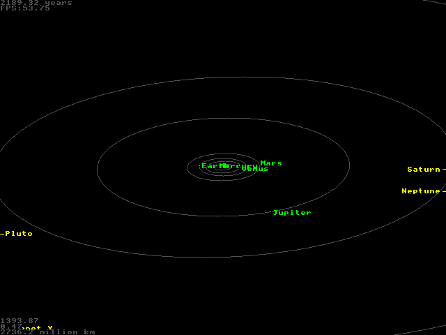

# Planets
A BBC BASIC program to simulate the solar system. This program was published in the February 1998 edition of Acorn User.

`Planets.bas` is a detokenised BBC BASIC file to allow the code to be viewed outside of RISC OS. `Planets,ffb` is the tokenised file for use on RISC OS.

To run it, you will need to either use an actual Acorn computer (such as the RISC PC), or install an emulator such as [RPCEmu](https://www.marutan.net/rpcemu/index.php). The `Planets,ffb` file can be dropped into the HostFS folder to make it available to the emulator. Within the emulator, open the HostFS file system and double-click on Planets to run.

# Controls
When running, the following keys control things:
A - Change to a Mars-focused view
J - Change to a Jupiter-focused view
S - Change to a Saturn-focused view
N - Change to a Neptune-focused view
U - 
' - Increase the angle of view in relation to a plane based on Earth's orbit
/ - Decrease the anfle of view in relation to a plane based on Earth's orbit
Left arrow - Decrease the time scale (slow the animation down)
Right arrow - Increase the time scale (speed the animation up)
Up arrow - Zoom in
Down arrow - Zoom out
Q - Return to teh solar-system view from a planet-focused view
Space - Toggle planet names
O - Toggle orbits
